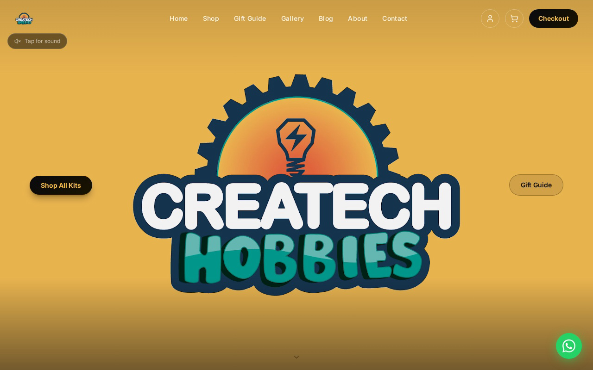

# Createch Hobbies

Createch Hobbies is a Nairobi business that sells DIY STEM kits for children. This repository is the public Next.js storefront and the owner admin dashboard for that shop.

The live store is [https://www.createch-hobbies.co.ke](https://www.createch-hobbies.co.ke).

Developed by Christopher Nguu Kioko.



## Features

- **Kit catalogue.** The shop reads the published WooCommerce catalogue: names, prices, sale prices, stock, images, categories, and the Level and Age Group tags.
- **Gift guide.** Recommendations are built from that same catalogue. Age groups match a curated list of product slugs, interest groups follow WooCommerce categories, and budget bands follow the live price.
- **Cart and checkout.** The cart is kept in the browser, then copied into a WooCommerce Store API cart at checkout. The amount charged is the WooCommerce total (including sale prices, coupons, and the delivery fee).
- **Payment order.** When the matching WooCommerce gateways are enabled, checkout offers M-Pesa STK Push first (`wc_mpesa_stk`), then DPO Pay cards (`woocommerce_dpo`), then pay on delivery (`cod`).
- **Delivery fees by neighbourhood.** The customer picks a Nairobi neighbourhood. `wordpress-plugin/createch-delivery-fees` prices the order on the server from that name.
- **Gateways switch on and off in WooCommerce.** `/api/payment-methods` returns the enabled gateways. Turning one off under WooCommerce → Settings → Payments removes it from checkout without a code change.
- **Server-side payment verification.** M-Pesa is marked paid by Safaricom's callback inside `wordpress-plugin/wc-mpesa-stk-push`. The checkout page only polls `/api/mpesa/status` to display that result. Card payments are confirmed with a DPO `verifyToken` check: `wordpress-plugin/createch-dpo-return-redirect` marks the WooCommerce order, and `/api/payment/status` asks the Django backend to verify the same token. The return URL is not treated as proof of payment.
- **Owner admin dashboard** at `/admin`. After a successful key check it shows revenue and order tiles, an orders table with CSV export, and a customer list with each customer's order history. Orders are loaded from the Django API.
- **Order alerts.** `wordpress-plugin/createch-order-alerts` emails the owner when an order becomes processing, on-hold, or completed, once per order. WhatsApp via CallMeBot is optional and configured in WordPress, not in this repository.

## Tech stack

- Next.js 15 (App Router), React 19, TypeScript, Tailwind CSS
- WooCommerce as the catalogue, checkout, and payment-gateway source, with the WordPress plugins in `wordpress-plugin/`
- A separate Django API for the admin order list and for DPO token verification

## Architecture

The storefront in this repository talks to two other systems.

1. **WordPress / WooCommerce** holds products, delivery fees, and payment gateways. Custom plugins in `wordpress-plugin/` cover M-Pesa STK Push, the DPO return redirect, neighbourhood delivery fees, owner order alerts, customer accounts, Store API CORS, and closing the duplicate WordPress shop.
2. **Django**, in a separate repository: [createch-backend](https://github.com/ChristopherKiokoStrathmore/createch-backend). This app calls it for `/admin` orders and for card-payment verification.

`lib/ipay.ts` and `/api/ipay/*` remain from an earlier iPay Africa integration. The checkout page does not call them. The payment history (Daraja STK, then IntaSend, then iPay, then the current WooCommerce gateways) is written up in `createch-hobbies-technical-report.html`.

## Local setup

```bash
npm install
cp .env.example .env.local
npm run dev
```

The app reads configuration from the environment. `.env.example` lists placeholders only. Never commit real values.

| Variable | Role |
| --- | --- |
| `WOO_URL` | WooCommerce site origin |
| `WOO_KEY` | WooCommerce REST consumer key |
| `WOO_SECRET` | WooCommerce REST consumer secret |
| `NEXT_PUBLIC_WOO_STORE_URL` | WooCommerce Store API base URL |
| `NEXT_PUBLIC_API_URL` | Django API base URL |
| `ADMIN_SECRET_KEY` | Admin dashboard key. Preferred. |
| `ADMIN_PIN` | Legacy admin key, accepted as a fallback. |

The dashboard refuses login when both `ADMIN_SECRET_KEY` and `ADMIN_PIN` are unset.

Optional:

| Variable | Role |
| --- | --- |
| `WC_WEBHOOK_SECRET` | Shared secret for product webhooks to `/api/revalidate`. Without it, catalogue reads refresh on a 60-second cycle. |
| `NEXT_PUBLIC_SITE_URL` | Public site origin for metadata. Defaults to the live store domain. |
| `IPAY_VENDOR_ID`, `IPAY_DATAKEY` | Used only by the unused iPay routes. |

## Scripts

- `npm run dev` — local dev server
- `npm run lint` — Next.js lint
- `npm run build` — production build
